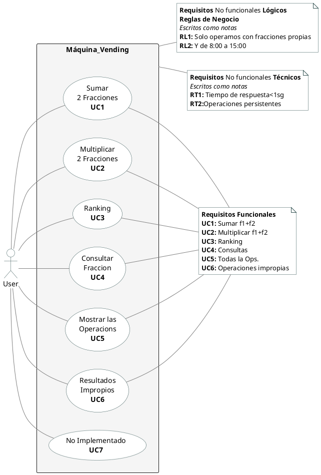
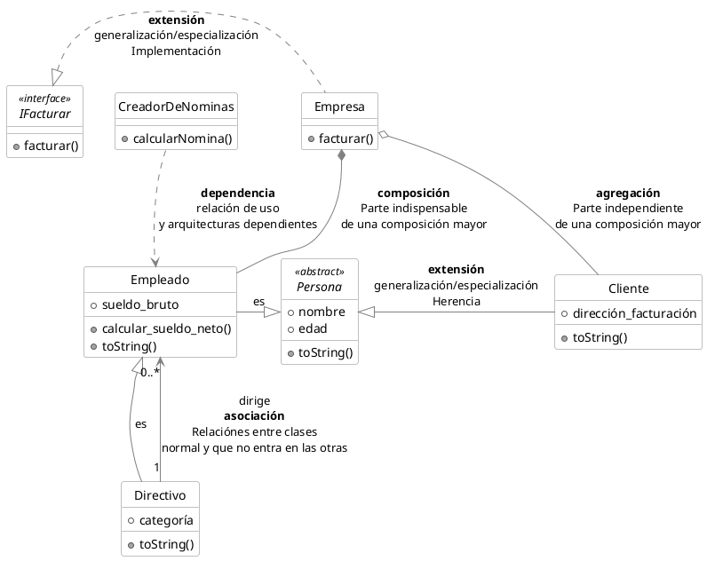
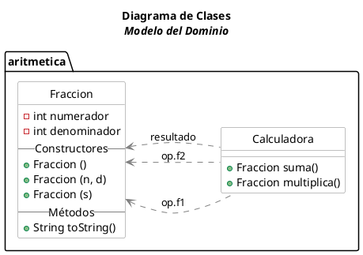
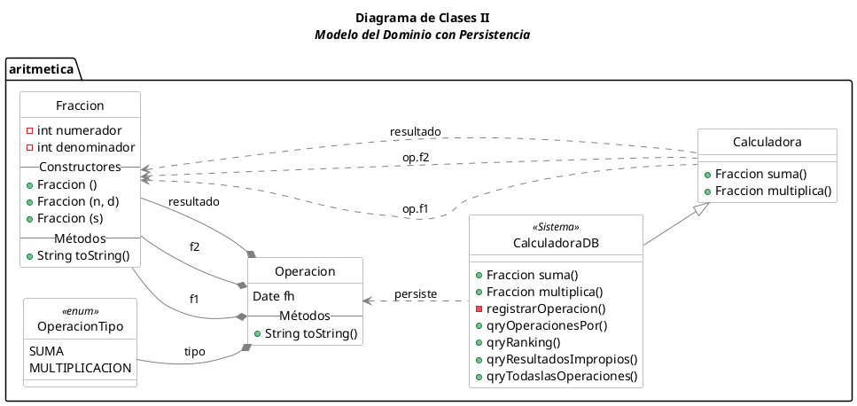
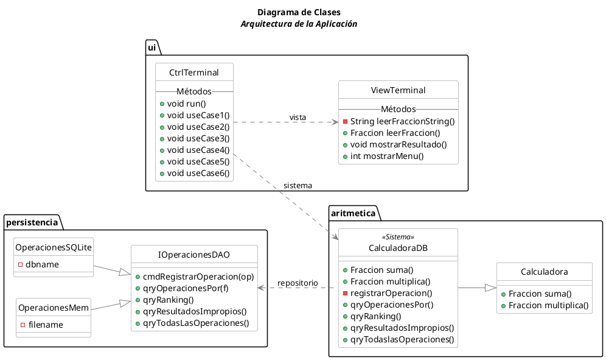
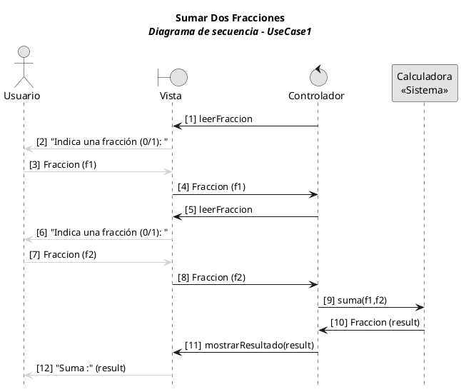
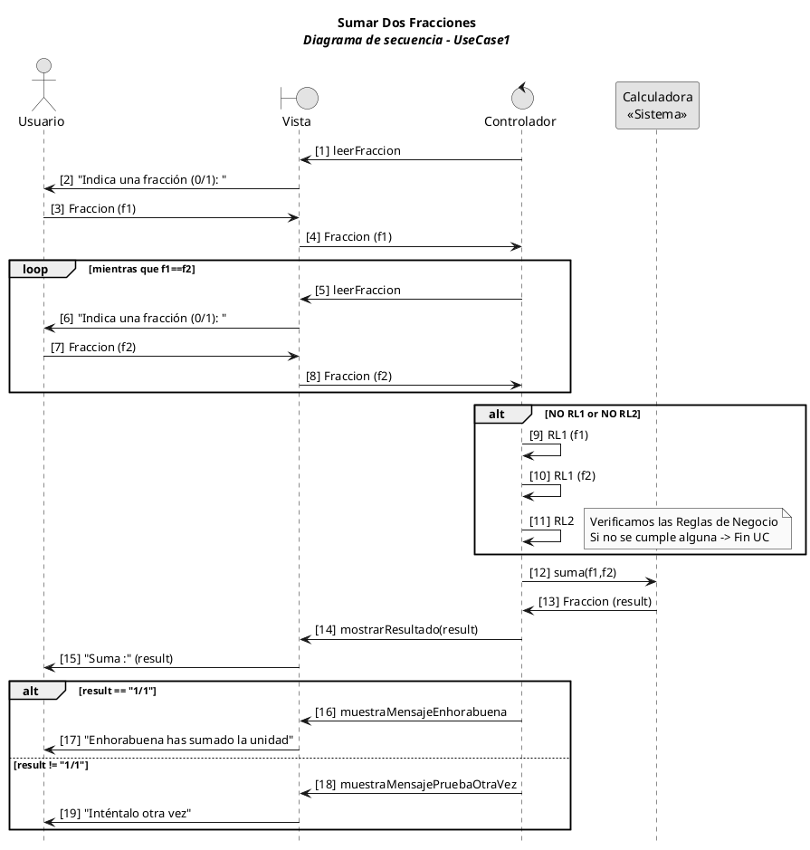

# test
Reccojo de otros años diagrmas en PlantUML
No soy muy fan, pero por si acaso.

Necesita el pluging de PlantUML

### Casos de uso de sistema

Mostramos varios posibles casos de uso, pero sólo desarrollamos en este documento enfocamos el **UC1** para mostrar cómo se puede llevar a código fuente, y ver distintas posibilidades de los diagramas UML.


<details><summary>Code #0</summary>


</details>

### Documento de Requistos
**Documento de Requisitos** a rellenar durante la evolución del proyecto.

| ID | Descripción requisito | Implementado en | Invocado desde | Estado | Sprint | Responsable |
| -- | -- | -- | -- | -- | -- | -- |
| UC1 | Suma de Fracciones | Calculadora.java<br>CalculadoraDB.java | Controlador.java|  Done| 
| UC2 | Multiplicación de Fracciones | Calculadora.java<br>CalculadoraDB.java 
| UC3 | Ranking de apariciones  | CalculadoraDB.java | Controlador.java | Done| 
| UC4 | Consulta de Fracciones | CalculadoraDB.java| Controlador.java | Done| 
| UC5 | Todas las Operaciones | CalculadoraDB.java | Controlador.java | Done| 
| UC6 | Resultados Impropias | CalculadoraDB.java | Controlador.java | Done|  
| UC7 | N/A | | | N/A | 
| RL1 | Fracciones propias | Requisitos.java | Controlador.java | Done|  
| RL2 | De 8:00 a 15:00 | Requisitos.java | Controlador.java | Done|   
| RT1 | Tiempo de respuesta de operacion <1sg. | | | Test | 
| RT2 | Operaciones persistentes | repostorios | CalculadoraDB| SQLite<br>File | 
   
   
### Caso de Uso 1 - Completo

Use case 01: **Sumar Dos Fracciones**  
**ID**: UC01   
**Nombre UC**: *Sumar Dos Fracciones*  
**Descripción**: Calcula la suma de dos fracciones. (Y las persiste)  
**Actor Principal**: El Usuario  
**Actores secundarios**: N/A  
**Precondiciones**: (ej: el usuario está correctamente identificado)
**Postcondiciones**: El sistema registra la operación correctamente.
**Flujo de Eventos:**
- **Flujo Normal o Básico**:
1. El sistema pide una fracción
1. El usuario introduce f1
1. El sistema pide otra fracción
1. El usuario introduce f2
   1. Si no RL1 f1 ir al punto 6
   1. Si no RL1 f2 ir al punto 6
   1. Si no RL2 ir al punto 6
1. El sistema suma f1 y f2 y presenta el resultado
1. El sistema finaliza el UC1
- **Flujo Alternativo**:  
  N/A

> La descripción de un caso de uso **completo** narra un escenario en forma de diálogo entre el _usuario_ y el _sistema_. Se concentra en el flujo principal aunque puede incluir escenarios alternativos, con el objetivo de describir la especificación general del requisito funcional recogido como caso de uso. Ha de incluir, código del UC, Título/Nombre, Descripción, Actores principales y secundarios y Pre y Postcondiciones.


### Diagrama Conceptual del Dominio
N/A

### Diagrama de Clases

Relación de '`Relaciones`' entre Clases (las más habituales).
| | Descripción |
|--|--|
| dependencia | relación de `uso` entre objetos |
| extensión | generalización o especialización<br>Usada para reflejar `herencias`|
| realización | idem que extensión<br>pero para `interfaces` |
| composición | refleja una `parte indispensable` de una clase |
| agregación | refleja una `parte independiente` de una clase |
| asociación | relacción `normal` entre clases<br>Suele tener *nombre*, *dirección* y *cardinalidad* |
|  |  |


<details><summary>Code #1</summary>


</details>


#### Diagrama Inicial
Se muestra _Fracción_ y _Calculadora_ como los únicos Modelos de Datos (Clases) principales del Dominio base sin introducir la persistencia.


<details><summary>Code #2</summary>


</details>

#### Diagrama con persistencia

Al añadir la persitencia para cumplir los requisitos de consultas y registro de operaciones,  se modifica el dominio añadiendo _Operación_ como Modelo de Datos a persistir y _CalculadoraDB_ como Modelo que deriva de la _Calculadora_ e interactuará con el motor de persitencia. 


<details><summary>Code #3</summary>


</details>

#### Diagrama de Arquitectura

Diagrama de Clases de Arquitectura de la aplicación. Es distinto del diagrama de clases del Modelo del Dominio. Este se centra en mostrar la Arquitectura de la aplicación, mostrarndo las clases que mecánicamente llevaran la información de la BD a la pantalla.   
En este caso se aplican los Patrones `MVC` y `Fachada` (CalculadoraDB) al Sistema.
Y Clase de `Acceso a Datos` con `Interface`, mostrando dos implementaciones.


<details><summary>Code #4</summary>


</details>


## Diagrama de secuencia

### Versión básica:  
> Mostramos el ejemplo más sencillo. Un escenario con un único flujo principal. Sin escenarios alternativos y a continuación el código que podría ser el guión del caso de uso dentro del Controlador.
> Tampoco se muestran la aplicación de las Reglas de Negocio.


<details><summary>Code #5</summary>


</details>


El código en el controlador:
```java
  public void useCase1() {
      // Punto de Entrada al Caso de Uso #1 
      // Indicando el número de mensaje en el diagrama 
      Fraccion f1 = viewTerminal.leerFraccion(); // 1..4
      Fraccion f2 = viewTerminal.leerFraccion(); // 5..8
      Fraccion result = sistema.suma(f1, f2); // 9..10
      viewTerminal.mostrarResultado(result); // 11
  }
```


### Versión con una caja de `loop` y `alt` 
>Versión pedagógica para mostrar alternativas de cómo se puede modelar un diagrama de secuencia mostrando un ciclo de repetición, y las alternativas secuencias en caso de escenarios distintos. 

`Loop` para indicar un ciclo. Se describe la condición de salida.
`Alt` para indicar una condición _IF_, y se describen las condiciones que escenifican las opciones.

El **Ciclo** mostraría como se repiten los mensajes entre los Participantes mientras se mantiene la condición. En este ejemplo la condición es que las fracciones f1 y f2 sean distintas.  
Mediante IF(`Alt`) mostramos como se podría modelar la verificación d euna regla de negocio sencilla y como se pueden escoger entre mensajes diferentes (`Enhorabuena` o `Inténtalo de nuevo`) dada una condición.


<details><summary>Code #6</summary>


</details>

